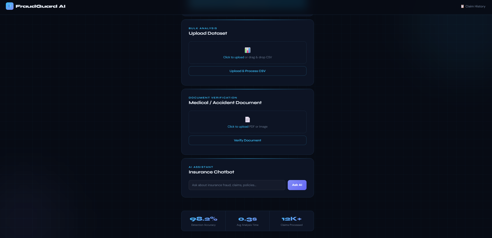
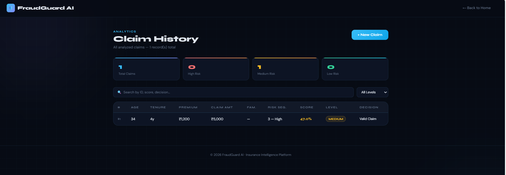

# 🧠 Insurance AI Fraud Detection System

An AI-powered web application that detects fraudulent insurance claims and provides intelligent recommendations using Machine Learning.

## 🚀 Features

- Fraud detection using Machine Learning
- Insurance eligibility prediction
- AI-based insurance recommendations
- Claim history tracking
- Document verification
- Chatbot support
- Voice input support
- Web interface using Flask

---

## 🛠 Tech Stack

**Backend**
- Python
- Flask

**Machine Learning**
- Scikit-learn
- Random Forest Classifier
- Pandas
- NumPy

**Frontend**
- HTML
- CSS

**Database**
- SQLite

---

## 📂 Project Structure

insurance_ai_system
│
├── app.py
├── config.py
├── database.py
├── requirements.txt
│
├── dataset/
│ └── insurance_data.csv
│
├── model/
│ ├── train_model.py
│ └── fraud_model.pkl
│
├── services/
│ ├── chatbot_service.py
│ ├── document_verifier.py
│ ├── eligibility_service.py
│ ├── explain_service.py
│ ├── insurance_recommender.py
│ └── prediction_service.py
│
├── templates/
│ ├── index.html
│ ├── result.html
│ └── history.html
│
└── utils/
└── voice_input.py

---

## ⚙️ Installation

### 1️⃣ Clone the repository

git clone https://github.com/yourusername/insurance-ai-system.git

### 2️⃣ Install dependencies

pip install -r requirements.txt

### 3️⃣ Train the model

python model/train_model.py

### 4️⃣ Run the application

python app.py

---

## 🌐 Access the Web App

Open in browser:

http://127.0.0.1:5000/

## 🌐 Website Preview

### Home Page

### Prediction Result

### Claim History

---

## 📊 Machine Learning Model

The system uses **Random Forest Classifier** for fraud detection because:

- Handles large datasets efficiently
- Reduces overfitting
- High prediction accuracy
- Works well with structured data

---

## 👩‍💻 Author

**Palem Ojaswini**

Mini Project – AI & Machine Learning

---

## 📜 License

This project is for educational purposes.